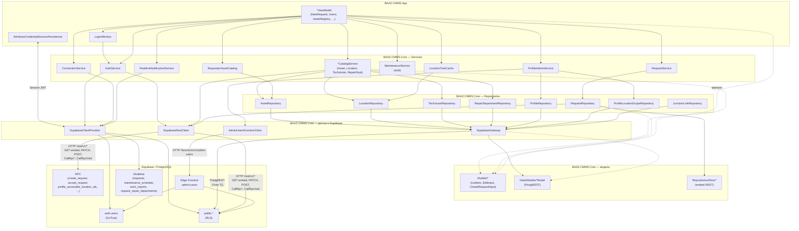

# Доступ приложения к БД

Схема взаимодействия **BAAZ.CMMS.App** с Supabase/PostgreSQL. Элементы диаграммы — типы и слои .NET.

## Диаграмма

## Слои

| Слой | Проект | Роль |
|------|--------|------|
| UI | `BAAZ.CMMS.App` | Страницы, ViewModel, WinUI. Без прямого доступа к БД. |
| Домен | `BAAZ.CMMS.Core/Services` | Бизнес-логика, оркестрация, маппинг в UI-модели (`Models/*`). |
| Данные | `BAAZ.CMMS.Core/Repositories` | I/O: таблицы, RPC, embed-запросы. |
| Транспорт | `SupabaseGateway`, `SupabaseRestClient`, `AdminUsersFunctionClient` | Три канала к Supabase (см. ниже). |

Сессия (JWT) хранится в **Windows Credential Manager** (`WindowsCredentialSessionPersistence`) и подставляется во все HTTP-вызовы через `SupabaseClientProvider`.

## Три канала к БД

| Канал | .NET API | Когда |
|-------|----------|-------|
| **SDK PostgREST** | `ISupabaseGateway.From<*Model>()` | Простой CRUD по одной таблице (`assets`, `locations`, `technicians`, …). |
| **Raw REST / RPC** | `SupabaseRestClient` | Join/embed (`requests` + связи), RPC жизненного цикла заявок, скалярные и массивные RPC. |
| **Edge Function** | `AdminUsersFunctionClient` | Админ-операции с `auth.users` (создание, бан, удаление) — service-role только на сервере. |

Дополнительно:

- **GoTrue** — `AuthService` → `Supabase.Client.Auth` (вход/выход).
- **Health** — `ConnectionService` → `GET /auth/v1/health`.
- **Realtime** — `RealtimeNotificationService` → подписки на `requests`, `maintenance_schedule`, `work_reports`, `request_repair_departments`; reconnect при восстановлении связи. App: `ShellNotificationPresenter`, `INavBadgeService`, `IWindowsToastService`.

## Модели данных

- `Data/Models/*Model` — PostgREST-таблицы (`[Table]`, snake_case колонки).
- `Repositories/Dtos/*` — узкие DTO для embed/join через raw REST.
- `Models/*` — UI-формы: `*ListItem`, `*EditInput`, `CreateRequestInput` и т.п.

ViewModel работает только с UI-моделями; репозитории не протекают в App.

## Примеры потоков

**Новая заявка (UC-R1):**

`NewRequestViewModel` → `RequestService` → `RequestRepository.CreateViaRpcAsync` → `SupabaseRestClient.CallRpcScalarAsync<Guid>` → `POST /rest/v1/rpc/create_request` → PostgreSQL `create_request()` → `CreateRequestResult`.

**Каталог оборудования (UC-A4):**

`AssetRegistryViewModel` → `IAssetCatalogService` → `AssetRepository` → `ISupabaseGateway.From<AssetModel>()` → `public.assets` (RLS) → `AssetListItem`.

**Пользователи (UC-A2):**

`UsersViewModel` → `ProfileAdminService` → `AdminUsersFunctionClient` (list/create/ban/delete) + `ProfileLocationScopeRepository` (scopes через PostgREST).

## Заметки

- `RequestRepository` — гибрид: RPC + raw REST с embed, не только `From<T>()`.
- RPC со скалярным `returns uuid` (например `create_request`) — через `CallRpcScalarAsync`; `returns uuid[]` — через `CallRpcAsync`.
- `MaintenanceService` пока stub — в диаграмме отмечен, к БД не ходит.
- RLS на стороне Postgres ограничивает видимость по роли (`admin`, `dispatcher`, `requester`); клиент всегда ходит с JWT пользователя, не с service-role.
