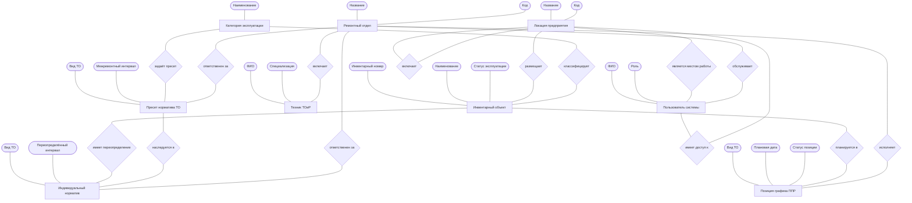
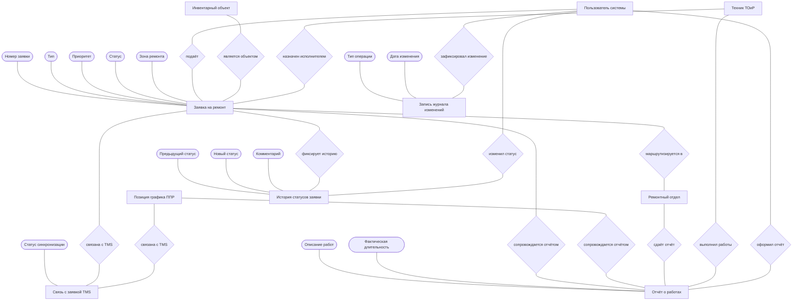

# Концептуальная модель данных — BAAZ CMMS

Высокоуровневое представление предметной области **без** технических деталей реализации (типы столбцов, схемы, ключи).

## Условные обозначения

| Фигура | Значение |
| --- | --- |
| Прямоугольник | Сущность |
| Овал / эллипс | Атрибут сущности |
| Ромб | Вид связи между сущностями |

На диаграмме у каждой сущности показаны **ключевые** атрибуты; полный перечень — в списке ниже.

---

## ER-диаграмма (организация, оборудование, ППР)

---

## ER-диаграмма (заявки, отчёты, интеграции, аудит)

---

## Сущности и атрибуты

- **Локация предприятия**
  - Название
  - Код
  - Признак активности
- **Ремонтный отдел**
  - Название
  - Код
  - Признак активности
- **Пользователь системы**
  - ФИО
  - Роль (администратор / диспетчер / заявитель)
  - Телефон
- **Техник ТОиР**
  - ФИО
  - Специализация
  - Признак активности
- **Инвентарный объект**
  - Инвентарный номер
  - Наименование
  - Статус эксплуатации
  - Дата ввода в эксплуатацию
  - Производитель
  - Модель
  - Серийный номер
  - Описание
- **Категория эксплуатации**
  - Наименование
  - Описание режима эксплуатации
  - Признак активности
- **Пресет норматива ТО**
  - Вид ТО (ТО-1 / ТО-2 / КР)
  - Межремонтный интервал
  - Описание работ
- **Индивидуальный норматив**
  - Вид ТО
  - Переопределённый интервал
  - Переопределённое описание
  - Признак переопределения ответственных отделов
- **Позиция графика ППР**
  - Вид ТО
  - Плановая дата
  - Статус позиции
- **Заявка на ремонт**
  - Номер заявки
  - Тип (авария / хозяйственная / осмотр)
  - Приоритет
  - Статус
  - Зона ремонта (на месте / в цехе / у подрядчика)
  - Описание места / объекта
  - Наименование подрядчика
  - Ссылка на внешний складской объект (инструмент TMS)
- **История статусов заявки**
  - Предыдущий статус
  - Новый статус
  - Комментарий
  - Дата изменения
- **Отчёт о работах**
  - Описание выполненных работ
  - Фактическая длительность
  - Вид(ы) ТО (для аварийных заявок)
  - Использованные материалы и запчасти
  - Обнаруженные дефекты
  - Примечания
- **Связь с заявкой TMS**
  - Идентификатор заявки во внешнем складе
  - Склад-источник
  - Статус синхронизации
  - Тип наряда (заявка / позиция ППР)
- **Запись журнала изменений**
  - Имя изменённой сущности (таблицы)
  - Тип операции (добавление / изменение / удаление)
  - Дата и время изменения
  - Снимок данных «было» / «стало»

> **Состояние ТО объекта** (дата последнего и следующего ТО по виду) на концептуальном уровне не выделено в отдельную сущность — это вычисляемый показатель, формируемый из **Отчёт о работах**, **Позиция графика ППР**, **Заявка на ремонт** и действующих нормативов.

---

## Виды связей между сущностями

| Связь | Участники | Смысл |
| --- | --- | --- |
| **включает** | Локация ↔ Локация | Иерархия мест (корпус → цех → участок) |
| **размещает** | Локация → Инвентарный объект | Физическое размещение оборудования |
| **является местом работы** | Локация → Пользователь системы | Место работы сотрудника (кабинет, отдел) |
| **имеет доступ к** | Пользователь системы ↔ Локация | Зона видимости заявителя (поддеревья якорных локаций) |
| **обслуживает** | Ремонтный отдел → Пользователь системы | Привязка диспетчера к службе ТОиР |
| **включает** | Ремонтный отдел → Техник ТОиР | Состав персонала отдела |
| **классифицирует** | Категория эксплуатации → Инвентарный объект | Режим эксплуатации оборудования |
| **задаёт пресет** | Категория эксплуатации → Пресет норматива ТО | Типовые нормативы ТО для категории |
| **имеет переопределение** | Инвентарный объект → Индивидуальный норматив | Индивидуальный override норматива |
| **наследуется в** | Пресет норматива ТО → Индивидуальный норматив | Базовые значения дополняются переопределением |
| **ответственен за** | Ремонтный отдел ↔ Пресет норматива ТО | Службы-исполнители пресета |
| **ответственен за** | Ремонтный отдел ↔ Индивидуальный норматив | Службы-исполнители при override |
| **планируется в** | Инвентарный объект → Позиция графика ППР | Запланированное ТО на объекте |
| **исполняет** | Ремонтный отдел ↔ Позиция графика ППР | Назначенные исполнители позиции ППР |
| **подаёт** | Пользователь системы → Заявка на ремонт | Создание заявки заявителем |
| **является объектом** | Инвентарный объект → Заявка на ремонт | Ремонт конкретного станка (необязательно) |
| **маршрутизируется в** | Заявка на ремонт ↔ Ремонтный отдел | Направление заявки в один или несколько отделов |
| **назначен исполнителем** | Техник ТОиР → Заявка на ремонт | Исполнитель в рамках отдела маршрута |
| **фиксирует историю** | Заявка на ремонт → История статусов заявки | Журнал переходов статуса |
| **изменил статус** | Пользователь системы → История статусов заявки | Кто выполнил переход |
| **сопровождается отчётом** | Заявка на ремонт → Отчёт о работах | Факт работ по заявке (один отчёт на отдел) |
| **сопровождается отчётом** | Позиция графика ППР → Отчёт о работах | Факт работ по ППР (один отчёт на отдел) |
| **сдаёт отчёт** | Ремонтный отдел → Отчёт о работах | Отдел-исполнитель отчитывается |
| **выполнил работы** | Техник ТОиР → Отчёт о работах | Фактический исполнитель |
| **оформил отчёт** | Пользователь системы → Отчёт о работах | Диспетчер, внёсший отчёт в систему |
| **связана с TMS** | Заявка на ремонт / Позиция графика ППР → Связь с заявкой TMS | Заявка на выдачу инструмента во внешнем складе |
| **зафиксировал изменение** | Пользователь системы → Запись журнала изменений | Автор изменения в аудите |

### Внешние системы (вне модели CMMS)

| Связь | Направление | Смысл |
| --- | --- | --- |
| **ведёт учёт инструмента** | TMS → Заявка на ремонт | Контур А: ремонт складского инструмента |
| **получает наряд на инструмент** | CMMS → TMS | Контур B: заявка на выдачу инструмента |
| **читает данные по станкам** | Учёт простоев (DT) ← CMMS | Справочник оборудования, заявки и отчёты по инвентарному номеру |

---

## Связь с другими уровнями

| Уровень | Файл |
| --- | --- |
| Логический | [`db-logical.md`](db-logical.md) |
| Физический | [`db-physical.md`](db-physical.md) |

Подробные описания столбцов — [`../DATABASE_TABLES.md`](../DATABASE_TABLES.md).
