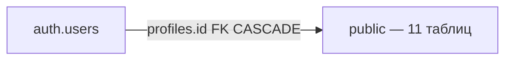

# Физическая модель данных — BAAZ CMMS (PostgreSQL / Supabase)

Реализация в СУБД: `auth.users` и основные таблицы `public.*`. Источник истины — `supabase/migrations/`.

> На ER-диаграмме — **11 основных** таблиц `public`; junction-таблицы, `audit_log`, `request_status_history` и view не показаны. В блоках сущностей — ключи (PK / FK / UK) и содержательные атрибуты с типами PostgreSQL.

## Обзор



| Схема | Назначение | RLS |
| --- | --- | --- |
| `auth` | Учётные записи Supabase Auth | Supabase |
| `public` | Операционные данные CMMS | Да (по ролям) |

---

## Enum-типы (`000_extensions_and_enums.sql`)

**Расширение:** `pg_cron` (ночная генерация ППР, пометка просрочки).

| Тип PostgreSQL | Значения |
| --- | --- |
| `public.user_role` | admin, dispatcher, requester |
| `public.asset_status` | active, maintenance, decommissioned |
| `public.maintenance_type` | to1, to2, kr |
| `public.schedule_status` | scheduled, in_progress, completed, overdue, cancelled |
| `public.request_type` | breakdown, service, inspection |
| `public.request_status` | new, accepted, in_progress, completed, closed, rejected, cancelled |
| `public.request_priority` | low, normal, high, critical |
| `public.repair_zone` | on_site, workshop, external |

---

## ER-диаграмма

```mermaid
erDiagram
    auth_users ||--|| profiles : "id"
    locations ||--o{ locations : "parent_id"
    locations ||--o{ profiles : "location_id"
    profiles }o--o{ locations : "зона доступа"
    locations ||--|{ assets : "location_id"

    repair_departments ||--o{ profiles : "repair_department_id"
    repair_departments ||--o{ technicians : "repair_department_id"
    repair_departments ||--o{ work_reports : "repair_department_id"
    repair_departments }o--o{ requests : "маршрут"
    repair_departments }o--o{ category_maintenance_norms : "ответственен"
    repair_departments }o--o{ maintenance_norms : "ответственен"
    repair_departments }o--o{ maintenance_schedule : "исполняет"
    repair_departments ||--o{ requests : "target_repair_department_id"

    equipment_categories ||--o{ assets : "category_id"
    equipment_categories ||--o{ category_maintenance_norms : "category_id"
    category_maintenance_norms }o..o{ maintenance_norms : "наследование"

    assets ||--o{ maintenance_norms : "asset_id"
    assets ||--|{ maintenance_schedule : "asset_id"
    assets ||--o{ requests : "asset_id"

    maintenance_schedule ||--o{ work_reports : "schedule_id"

    profiles ||--|{ requests : "requester_id"
    profiles ||--|{ work_reports : "author_id"

    technicians }o--o{ requests : "исполнитель"
    technicians ||--|{ work_reports : "technician_id"

    requests ||--o{ work_reports : "request_id"

    auth_users {
        uuid id PK
        text email UK
        text encrypted_password
    }

    profiles {
        uuid id PK_FK
        uuid location_id FK
        uuid repair_department_id FK
        user_role role
        text full_name
        text phone
    }

    locations {
        uuid id PK
        uuid parent_id FK
        text code UK
        text name
        boolean is_active
    }

    repair_departments {
        uuid id PK
        text code UK
        text name
        boolean is_active
    }

    technicians {
        uuid id PK
        uuid repair_department_id FK
        text full_name
        text specialty
        boolean is_active
    }

    equipment_categories {
        uuid id PK
        text name UK
        text description
        boolean is_active
    }

    assets {
        uuid id PK
        text asset_number UK
        uuid location_id FK
        uuid category_id FK
        text name
        text manufacturer
        text model
        text serial_number
        date commissioning_date
        asset_status status
        text description
    }

    category_maintenance_norms {
        uuid id PK
        uuid category_id FK_UK
        maintenance_type maintenance_type UK
        integer interval_days
        text description
    }

    maintenance_norms {
        uuid id PK
        uuid asset_id FK_UK
        maintenance_type maintenance_type UK
        integer interval_days
        text description
        boolean override_departments
    }

    maintenance_schedule {
        uuid id PK
        uuid asset_id FK
        maintenance_type maintenance_type
        date planned_date
        schedule_status status
        boolean notify_dispatchers
    }

    requests {
        uuid id PK
        text request_number UK
        uuid asset_id FK
        uuid requester_id FK
        uuid target_repair_department_id FK
        request_type type
        text location_description
        text title
        text description
        request_priority priority
        repair_zone repair_zone
        text contractor_name
        request_status status
    }

    work_reports {
        uuid id PK
        uuid request_id FK_UK
        uuid schedule_id FK_UK
        uuid repair_department_id FK_UK
        uuid author_id FK
        uuid technician_id FK
        maintenance_type maintenance_type
        maintenance_type[] maintenance_types
        text work_performed
        numeric actual_duration_hours
        jsonb parts_used
        text defects_found
        text notes
    }
```

> **Составные UK:** `(category_id, maintenance_type)` в `category_maintenance_norms`; `(asset_id, maintenance_type)` в `maintenance_norms`. **Partial UNIQUE** в `work_reports`: `(request_id, repair_department_id)`, `(schedule_id, repair_department_id)`.

---

## Таблицы — сводка

| Таблица | PK | Уникальные ограничения | Миграция |
| --- | --- | --- | --- |
| `locations` | `id uuid` | `code` | 010 |
| `repair_departments` | `id uuid` | `code` | 010 |
| `profiles` | `id uuid` → auth.users | — | 010 |
| `technicians` | `id uuid` | — | 010 |
| `equipment_categories` | `id uuid` | `name` | 010 |
| `assets` | `id uuid` | `asset_number` | 010 |
| `category_maintenance_norms` | `id uuid` | `(category_id, maintenance_type)` | 020 |
| `maintenance_norms` | `id uuid` | `(asset_id, maintenance_type)` | 020 |
| `maintenance_schedule` | `id uuid` | — | 020 |
| `requests` | `id uuid` | `request_number` | 030 |
| `work_reports` | `id uuid` | partial unique (см. ниже) | 030 |

### CHECK-ограничения

| Таблица | Условие |
| --- | --- |
| `profiles` | `role <> 'dispatcher' OR repair_department_id IS NOT NULL` |
| `requests` | `asset_id IS NOT NULL OR nullif(trim(location_description), '') IS NOT NULL` |
| `work_reports` | `request_id IS NOT NULL OR schedule_id IS NOT NULL` |

### Частичные уникальные индексы

| Индекс | Условие |
| --- | --- |
| `work_reports_schedule_dept_unique` | `(schedule_id, repair_department_id)` WHERE schedule_id NOT NULL |
| `work_reports_request_dept_unique` | `(request_id, repair_department_id)` WHERE request_id NOT NULL |

### Индексы (выборочно)

| Таблица | Индекс |
| --- | --- |
| `work_reports` | `(repair_department_id)` |

---

## Триггеры и автоматизация

| Компонент | Файл | Эффект |
| --- | --- | --- |
| Asset status sync | `080_triggers.sql` | `in_progress` → maintenance; `closed` → active |
| Schedule completion | `070_functions_triggers.sql` | Все отделы отчитались → `schedule.status = completed` |
| Request completion | `070_functions_triggers.sql` | Все отделы отчитались → `requests.status = completed` |
| pg_cron | `000_extensions_and_enums.sql` | `generate_ppr_schedule`, `mark_overdue_schedule_items` |
| RPC | `060_functions_domain_rpc.sql` | жизненный цикл заявок, `create_schedule_entry` |
| Realtime | `150_realtime_publication.sql` | `requests`, `maintenance_schedule`, `work_reports`, `request_repair_departments` |

---

## RLS (`110`–`145`)

| Область | Файл | Принцип |
| --- | --- | --- |
| Справочники | `110_rls_catalog.sql` | admin — всё; requester/dispatcher — read по scope |
| ППР | `120_rls_maintenance.sql` | dispatcher — свой `repair_department_id` |
| Заявки | `130_rls_requests.sql` | requester — свои; dispatcher — свой отдел + очередь `new` |

---

## Карта миграций → объекты

| Файл | Объекты |
| --- | --- |
| `000_extensions_and_enums.sql` | extensions, enums |
| `010_tables_catalog.sql` | locations … assets |
| `020_tables_maintenance.sql` | norms, schedule |
| `030_tables_requests.sql` | requests, work_reports |
| `050_functions_security_helpers.sql` | RLS helpers, scope functions |
| `060_functions_domain_rpc.sql` | RPC заявок и ППР |
| `070_functions_triggers.sql` | trigger functions |
| `080_triggers.sql` | CREATE TRIGGER |
| `100_grants.sql` | GRANT на public |
| `110`–`145` | RLS policies |
| `150_realtime_publication.sql` | realtime |

---

## Связь с другими уровнями

| Уровень | Файл |
| --- | --- |
| Концептуальный | [`db-conceptual.md`](db-conceptual.md) |
| Логический | [`db-logical.md`](db-logical.md) |

Описание столбцов по таблицам — [`../DATABASE_TABLES.md`](../DATABASE_TABLES.md).

PlantUML: [`db-physical.puml`](db-physical.puml)
