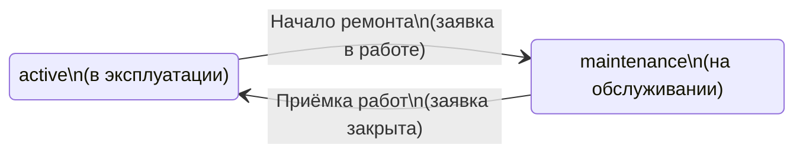

# Диаграмма состояний (statechart) — заявка на ремонт

Жизненный цикл заявки на ремонт: статусы, переходы и совместная работа нескольких ремонтных отделов. Источник: [`docs/use-cases/overview.md`](../use-cases/overview.md).

Сопутствующие диаграммы: [последовательность](request-lifecycle.md) · PlantUML: [`request-lifecycle-statechart.puml`](request-lifecycle-statechart.puml)

---

## Statechart

```mermaid
stateDiagram-v2
    direction TB

    state "new (новая)" as new
    state "accepted (принята)" as accepted
    state "in_progress (выполняется)" as in_progress
    state "completed (выполнена)" as completed
    state "closed (закрыта)" as closed
    state "rejected (отклонена)" as rejected
    state "cancelled (отменена)" as cancelled

    [*] --> new: Создание заявки (заявитель)

    new --> accepted: Принятие заявки (диспетчер отдела)
    new --> rejected: Отклонение заявки (диспетчер)
    new --> cancelled: Отмена заявки (заявитель)

    accepted --> accepted: Назначение исполнителей, смена зоны ремонта, подключение или передача другому отделу (диспетчеры отделов; статус не меняется)

    accepted --> in_progress: Начало работ (диспетчер; у каждого подключённого отдела назначен исполнитель)
    accepted --> cancelled: Отмена заявки (заявитель)

    in_progress --> in_progress: Совместная работа отделов. Каждый отдел ведёт свою часть ремонта и сдаёт свой отчёт (диспетчеры отделов)

    in_progress --> completed: Все подключённые отделы сдали отчёты о работах (система)
    in_progress --> cancelled: Отмена заявки (заявитель)

    completed --> closed: Приёмка выполненных работ (заявитель или диспетчер)

    rejected --> [*]
    cancelled --> [*]
    closed --> [*]
```

> Одна заявка может одновременно вестись **несколькими ремонтными отделами** (например, РМУ и энергетика): у каждого — свой исполнитель и свой отчёт. Заявка переходит в «выполнена», только когда отчитались **все** подключённые отделы. При начале и закрытии работ статус связанного оборудования меняется на «на обслуживании» / «в эксплуатации».

---

## Состояния

| Состояние | Смысл | Что происходит |
| --- | --- | --- |
| **new** (новая) | Заявка подана, не разобрана | Ожидает решения диспетчера |
| **accepted** (принята) | Заявка принята в работу | Назначают исполнителей, при необходимости подключают ещё отделы; несколько отделов могут готовиться параллельно |
| **in_progress** (выполняется) | Ремонт идёт | Отделы работают параллельно; каждый сдаёт свой отчёт |
| **completed** (выполнена) | Все отделы отчитались | Ожидает приёмки заявителем |
| **closed** (закрыта) | Работы приняты | Успешное завершение |
| **rejected** (отклонена) | Заявка отклонена | Конечное состояние |
| **cancelled** (отменена) | Заявка отменена заявителем | Конечное состояние |

---

## Переходы

| Из | Действие | В | Кто инициирует | Условие |
| --- | --- | --- | --- | --- |
| — | Создание заявки | new | Заявитель | — |
| new | Принятие заявки | accepted | Диспетчер принявшего отдела | Заявка в очереди «новые» |
| new | Отклонение заявки | rejected | Диспетчер | С указанием причины |
| new | Отмена заявки | cancelled | Заявитель | Пока работы не завершены |
| accepted | Подготовка (назначение, маршрут) | accepted | Диспетчеры отделов | Статус заявки не меняется |
| accepted | Начало работ | in_progress | Диспетчер | У **каждого** подключённого отдела назначен исполнитель |
| accepted | Отмена заявки | cancelled | Заявитель | — |
| in_progress | Работа и отчёты отделов | in_progress | Диспетчеры отделов | Каждый отдел — свой исполнитель и свой отчёт |
| in_progress | Завершение работ | completed | Система | Отчитывались **все** подключённые отделы |
| in_progress | Отмена заявки | cancelled | Заявитель | — |
| completed | Приёмка работ | closed | Заявитель или диспетчер | Все отделы ранее отчитались |

---

## Синхронизация статуса оборудования

Применяется, если в заявке указан объект из реестра оборудования и он не снят с эксплуатации.

---

## Конечные состояния

| Состояние | Когда наступает |
| --- | --- |
| **closed** | Успешный сценарий: от создания до приёмки работ |
| **rejected** | Диспетчер отклонил заявку как необоснованную |
| **cancelled** | Заявитель отменил до или во время ремонта |

PlantUML: [`request-lifecycle-statechart.puml`](request-lifecycle-statechart.puml)
