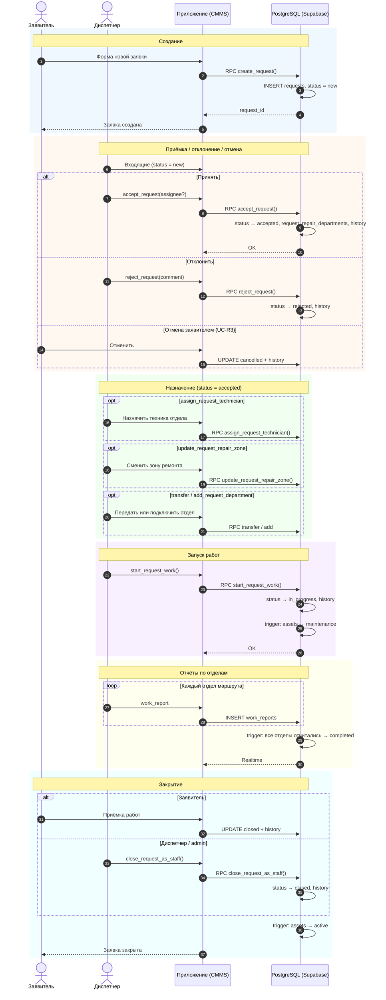
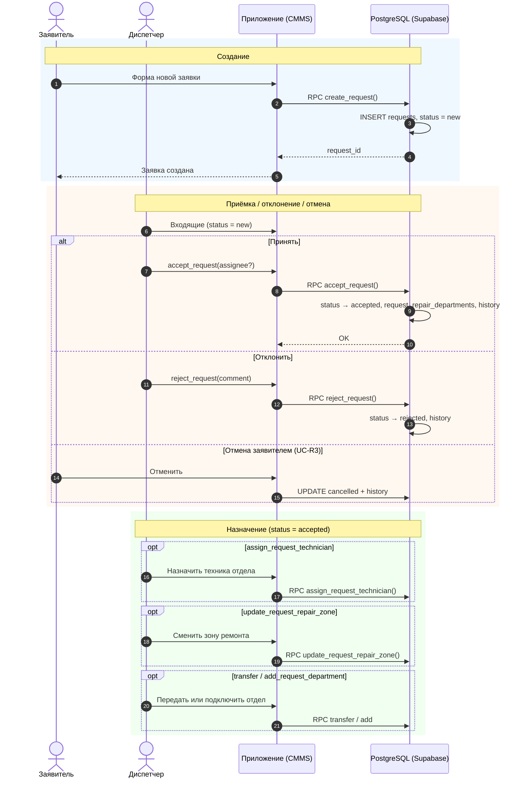
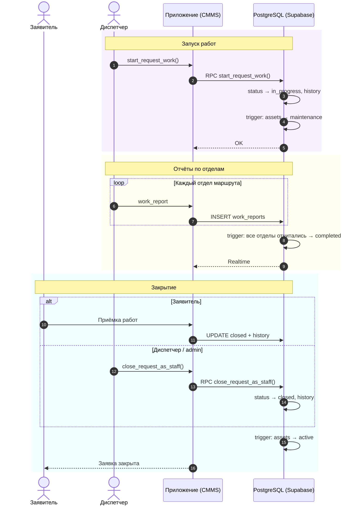

# Жизненный цикл заявки на ремонт — BAAZ CMMS

Диаграмма последовательности основного сценария и ключевых альтернатив. Источник: [`docs/use-cases/overview.md`](../use-cases/overview.md) (UC-R1…R4, UC-D1…D2), RPC в `supabase/migrations/060_functions_domain_rpc.sql`.

**Диаграмма состояний (statechart):** [`request-lifecycle-statechart.md`](request-lifecycle-statechart.md)

---

## Диаграмма последовательности (полная)

---

## Диаграмма последовательности (часть 1 — до запуска работ)

Создание, приёмка и назначение (статус `accepted`).

---

## Диаграмма последовательности (часть 2 — запуск работ и закрытие)

Продолжение после назначения (статус `accepted` → … → `closed`).

---

## Участники и операции

| Участник | Действия |
| --- | --- |
| **Заявитель** | `create_request`, отмена (`cancelled`), приёмка (`closed`) |
| **Диспетчер** | `accept_request` / `reject_request`, назначение и маршрутизация, `start_request_work`, `work_reports`, `close_request_as_staff` |
| **CMMS** | WinUI-страницы + `IRequestService` → PostgREST / RPC |
| **PostgreSQL** | Таблицы `requests`, `request_repair_departments`, `request_status_history`, `work_reports`; триггеры завершения и статуса оборудования |

## Переходы статуса

| Из | В | Инициатор | Механизм |
| --- | --- | --- | --- |
| — | `new` | Заявитель | RPC `create_request` |
| `new` | `accepted` | Диспетчер | RPC `accept_request` |
| `new` | `rejected` | Диспетчер | RPC `reject_request` |
| `new` / `accepted` / `in_progress` | `cancelled` | Заявитель | PATCH + history |
| `accepted` | `in_progress` | Диспетчер | RPC `start_request_work` |
| `in_progress` | `completed` | Система | Триггер после отчётов всех отделов |
| `completed` | `closed` | Заявитель или staff | PATCH или RPC `close_request_as_staff` |

PlantUML: [`request-lifecycle.puml`](request-lifecycle.puml) · Statechart: [`request-lifecycle-statechart.puml`](request-lifecycle-statechart.puml)
