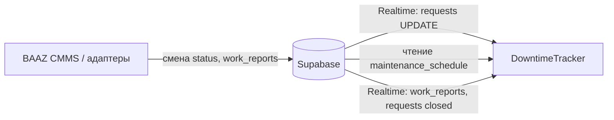

# Use-cases: интеграция с DowntimeTracker

Спецификация сценариев взаимодействия **BAAZ CMMS** (АС ТОиР) со смежной системой **DowntimeTracker** (`downtime-tracker`) — учёт технологических и аварийных простоев оборудования.

> **Важно:** приложение DowntimeTracker разрабатывается **в отдельном репозитории**. В BAAZ CMMS реализуются только **интерфейсы и адаптеры** для обмена данными; производственный календарь и OEE-аналитика в этом проекте не ведутся.

> **MVP интеграции (ручная синхронизация, read-only):** см. [`docs/DOWNTIME_TRACKER_INTEGRATION.md`](../DOWNTIME_TRACKER_INTEGRATION.md). Ниже — **целевая** модель с Realtime и автособытиями (v2).

Основание: схема данных в [`DATABASE_TABLES.md`](../DATABASE_TABLES.md).

## Обзор обмена

| Направление | Источник | Потребитель | Данные |
| --- | --- | --- | --- |
| BAAZ CMMS → DowntimeTracker | `requests` | DowntimeTracker | Начало аварийного простоя (`in_progress`) |
| BAAZ CMMS → DowntimeTracker | `maintenance_schedule` | DowntimeTracker | Плановые технологические окна |
| BAAZ CMMS → DowntimeTracker | `work_reports`, `requests` | DowntimeTracker | Окончание простоя, длительность ремонта |
| DowntimeTracker → BAAZ CMMS | — | — | Прямой записи в BAAZ CMMS не требуется (read-only потребление) |

Ключевые поля: `asset_id`, `request_id`, `planned_date`, `status`, `actual_duration_hours`, `type` = `breakdown` для MTTR.

---

## UC-DT1 — Автоматическое открытие записи о техническом простое

**Инициатор:** BAAZ CMMS (диспетчер переводит аварийную заявку в работу)

**Цель:** зафиксировать начало останова оборудования без ручного ввода в DowntimeTracker.

**Предусловия:** заявка с `type` = `breakdown`, указан `asset_id`.

**Основной сценарий:**

1. Диспетчер переводит заявку в `status` = `in_progress` (UC-D2).
2. DowntimeTracker получает событие Supabase Realtime (`UPDATE` на `requests`).
3. В журнале простоев DowntimeTracker создаётся запись: `start_time`, привязка к `asset_id` и `request_id` как первопричине останова.
4. Параллельно в BAAZ CMMS триггер устанавливает `assets.status` = `maintenance`.

**Затронутые сущности BAAZ CMMS:** `requests`, `assets`.

**Реализация в BAAZ CMMS:** исходящее событие `OnRequestStatusChanged`; DowntimeTracker — подписчик Realtime. Адаптер BAAZ CMMS может дублировать payload для тестов без внешней системы.

---

## UC-DT2 — Планирование производственной сетки на основе графика ППР

**Инициатор:** DowntimeTracker (производственный диспетчер / планировщик)

**Цель:** зарезервировать технологические окна под плановые `to1`, `to2`, `kr`, чтобы не назначать смены на остановленные станки.

**Предусловия:** в BAAZ CMMS сформированы позиции `maintenance_schedule`.

**Основной сценарий:**

1. DowntimeTracker периодически или по Realtime читает `maintenance_schedule` со статусом `scheduled` (и при необходимости `overdue`).
2. Для каждой строки используются `asset_id`, `maintenance_type`, `planned_date`.
3. В интерфейсе DowntimeTracker строится календарь «технологических окон»; смены на эти даты не планируются.

**Затронутые сущности BAAZ CMMS:** `maintenance_schedule`, `assets`, `locations` (для фильтра по цеху).

**Реализация в BAAZ CMMS:** read-only доступ; изменения графика (UC-D5) автоматически отражаются при следующем чтении или через Realtime на `maintenance_schedule`.

---

## UC-DT3 — Автоматическое закрытие простоя по факту ремонта

**Инициатор:** BAAZ CMMS (завершение и закрытие заявки)

**Цель:** проставить `end_time` простоя и вычислить длительность аварийного останова.

**Предусловия:** для `request_id` в DowntimeTracker уже открыт простой (UC-DT1).

**Основной сценарий:**

1. Диспетчер создаёт `work_reports` с `actual_duration_hours` и переводит заявку в `completed`, затем в `closed` (UC-D4, UC-R4).
2. DowntimeTracker реагирует на `UPDATE` `requests.status` = `closed` **или** на INSERT `work_reports` (политика — на стороне DowntimeTracker; рекомендуется закрытие по `closed`).
3. В записи простоя заполняется `end_time`; длительность согласуется с `actual_duration_hours` из отчёта.

**Затронутые сущности BAAZ CMMS:** `work_reports`, `requests`, `request_status_history`.

**Реализация в BAAZ CMMS:** публикация событий закрытия; контракт — `request_id`, `asset_id`, `actual_duration_hours`, `closed_at`.

---

## UC-DT4 — Расчёт аналитических метрик (OEE / MTTR)

**Инициатор:** DowntimeTracker (аналитический модуль)

**Цель:** строить показатели надёжности и структуру потерь для руководства.

**Предусловия:** накоплены данные простоев в DowntimeTracker и отчёты работ в BAAZ CMMS.

**Основной сценарий:**

1. DowntimeTracker агрегирует собственные записи простоев (организационные причины: ожидание оператора, отсутствие сырья и т.д.).
2. Из BAAZ CMMS читаются `work_reports` (`actual_duration_hours`) и аварийные заявки (`type` = `breakdown`, связь по `request_id` / `asset_id`).
3. Рассчитываются MTTR, вклад ремонта в потери времени, компоненты OEE (детали формул — в DowntimeTracker).

**Затронутые сущности BAAZ CMMS:** `work_reports`, `requests`, `assets`.

**Реализация в BAAZ CMMS:** read-only адаптер или прямой запрос к Supabase; BAAZ CMMS не вычисляет OEE.

---

## Контракт интеграции (черновик)

| Операция | Направление | Триггер |
| --- | --- | --- |
| `OnRequestStatusChanged` | BAAZ CMMS → DowntimeTracker | `requests.status` → `in_progress`, `closed` |
| `GetScheduledMaintenance` | DowntimeTracker → BAAZ CMMS | Чтение `maintenance_schedule` |
| `GetWorkReportsForPeriod` | DowntimeTracker → BAAZ CMMS | Аналитика UC-DT4 |
| `OnWorkReportCreated` | BAAZ CMMS → DowntimeTracker | INSERT `work_reports` (опционально для UC-DT3) |

Рекомендуемые подписки Realtime в Supabase: `requests`, `maintenance_schedule`, `work_reports` (включить таблицы в publication).

## Границы ответственности

| Система | Отвечает за |
| --- | --- |
| BAAZ CMMS | Заявки, график ППР, отчёты, статусы оборудования в `assets` |
| DowntimeTracker | Журнал простоев, производственный календарь, OEE/MTTR, организационные простои |

Пересечение только по идентификаторам `asset_id`, `request_id`, `schedule_id` и временным меткам из BAAZ CMMS.

## Связанные use-cases BAAZ CMMS

- [UC-D2](overview.md#uc-d2--назначение-исполнителя-и-запуск-ремонта) — старт простоя
- [UC-D3](overview.md#uc-d3--мониторинг-графиков-плановых-ремонтов) — источник плановых окон
- [UC-D4](overview.md#uc-d4--регистрация-отчёта-о-выполненных-работах) — фактическая длительность ремонта
- [UC-D5](overview.md#uc-d5--управление-жизненным-циклом-графика-ппр) — отмена/просрочка плановых окон
