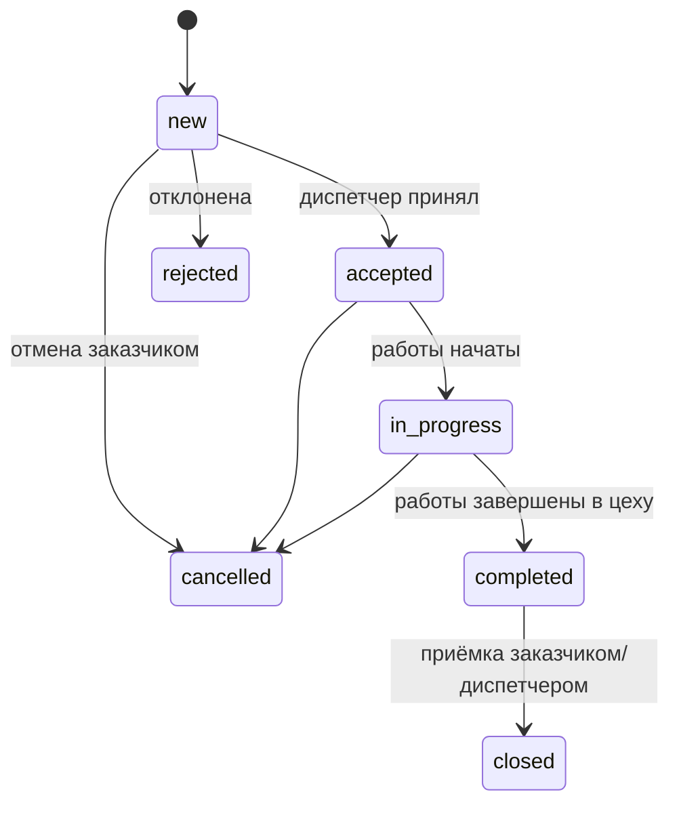
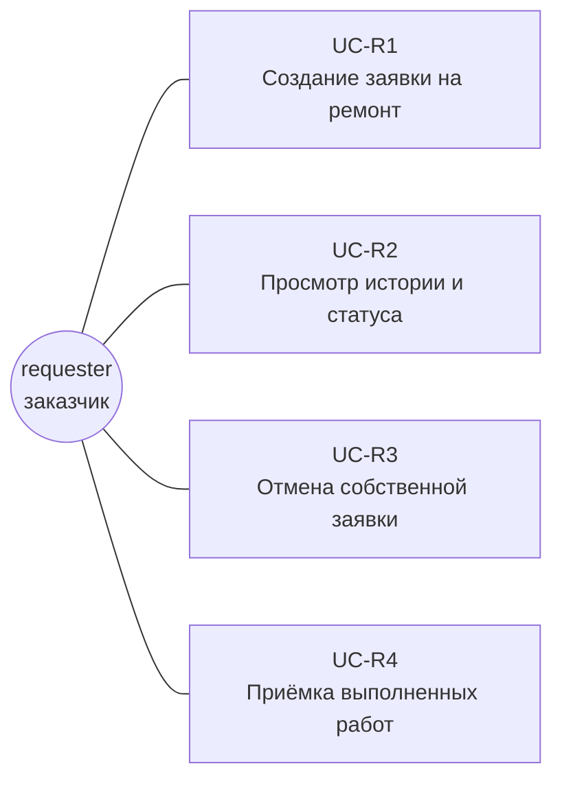
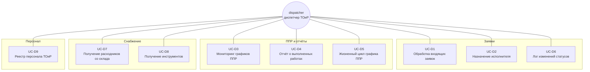
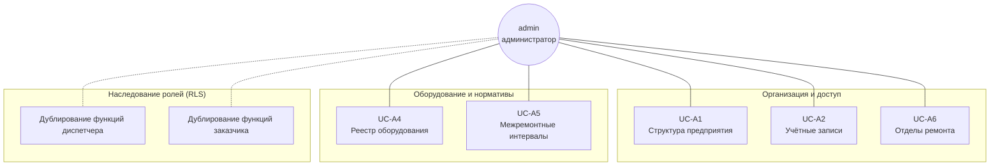
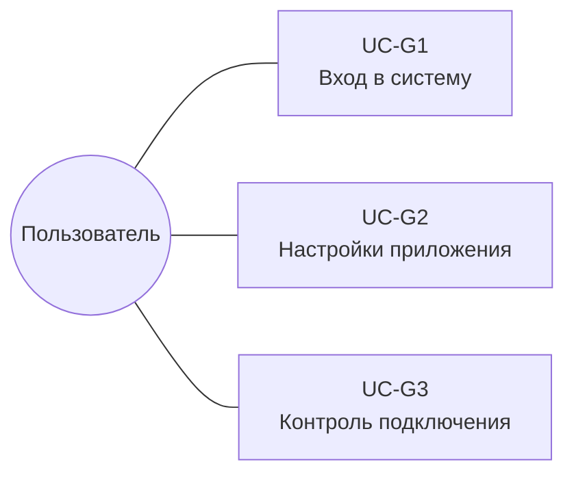

# Use-cases: АС ТОиР (BAAZ CMMS)

Спецификация прецедентов использования десктопного приложения **BAAZ CMMS** — системы учёта и планирования технического обслуживания и ремонта оборудования ОАО «БААЗ».

Основание: схема данных в [`DATABASE_TABLES.md`](../DATABASE_TABLES.md).

## Роли

| Роль | Основная зона ответственности |
| --- | --- |
| `requester` | Подача заявок, отслеживание и приёмка своих работ |
| `dispatcher` | Обработка заявок, назначение исполнителей, отчёты, график ППР, снабжение (расходники, инструмент), реестр персонала ТОиР |
| `admin` | Справочники, пользователи, нормативы, реестр оборудования |

## Жизненный цикл заявки

При переходе в `in_progress` (если указан `asset_id`) статус объекта в `assets` синхронизируется в `maintenance`; при `closed` — обратно в `active` (кроме `decommissioned`).

---

## Requester (заказчик)

### UC-R1 — Создание заявки на ремонт

**Action ID:** `act.requests.create`

**Актор:** `requester`

**Цель:** зафиксировать неисправность или потребность в обслуживании.

**Основной сценарий:**

1. Пользователь открывает форму новой заявки.
2. Заполняет `title`, `description`, выбирает `priority` и `type` (`breakdown`, `service` или `inspection`).
3. Указывает объект: либо `asset_id` из реестра, либо текст в `location_description` (минимум одно из двух обязательно).
4. **`repair_zone`** заявитель и диспетчер при создании **не** задают — в БД остаётся `on_site`; зону ремонта (`on_site`, `workshop`, `external`) назначает диспетчер на карточке заявки (UC-D2). **Исключение:** администратор при создании заявки на `NewRequest` **может** сразу указать `repair_zone`.
5. Система создаёт запись в `requests` со статусом `new`, `requester_id` = текущий профиль, автоматическим `request_number`.

**Затронутые сущности:** `requests`, `profiles`, `assets` (опционально).

---

### UC-R2 — Просмотр истории и статуса своих заявок

**Action ID:** `act.requests.my_list`

**Актор:** `requester`

**Цель:** отслеживать состояние поданных заявок.

**Основной сценарий:**

1. Пользователь открывает список заявок, отфильтрованный по `requester_id`.
2. Видит текущий `status`, приоритет, задействованные отделы и назначенных исполнителей (`request_repair_departments` → `technicians`), зону ремонта (`repair_zone`) и подрядчика (`contractor_name`, если `repair_zone = 'external'`), даты создания и обновления.
3. Список и детали обновляются по Supabase Realtime (`requests`); badge на «Мои заявки» и Windows toast при смене статуса (если страница не открыта).

**Затронутые сущности:** `requests`, `request_repair_departments`, `technicians`.

---

### UC-R3 — Отмена собственной заявки

**Action ID:** `act.requests.cancel`

**Актор:** `requester`

**Цель:** снять заявку, если проблема устранена до начала работ в цехе.

**Предусловия:** заявка принадлежит текущему пользователю; статус допускает отмену (`new`, `accepted` — уточняется политикой RLS и UI).

**Основной сценарий:**

1. Заказчик выбирает заявку и инициирует отмену.
2. Система переводит `status` в `cancelled`.
3. В `request_status_history` фиксируется смена статуса с комментарием.

**Затронутые сущности:** `requests`, `request_status_history`.

---

### UC-R4 — Приёмка выполненных работ (закрытие заявки)

**Action ID:** `act.requests.accept`

**Актор:** `requester` (либо `dispatcher` по делегированию)

**Цель:** подтвердить, что оборудование исправно и работы приняты.

**Предусловия:** `status` = `completed` (отчёт в `work_reports` уже внесён диспетчером).

**Основной сценарий:**

1. Заказчик проверяет оборудование на месте.
2. Переводит заявку из `completed` в `closed` (заявитель — прямой путь; диспетчер/admin — через RPC `close_request_as_staff(p_request_id, p_comment?)`).
3. При наличии `asset_id` триггер возвращает `assets.status` в `active`.

**Затронутые сущности:** `requests`, `request_status_history`, `assets`.

---

## Dispatcher (диспетчер ТОиР)

### UC-D1 — Обработка и фильтрация входящих заявок

**Action ID:** `act.requests.incoming`

**Актор:** `dispatcher`

**Цель:** разобрать поток новых обращений и отсеять ложные.

**Основной сценарий:**

1. Диспетчер открывает общую очередь заявок с `status` = `new` — она видна **всем** диспетчерам независимо от отдела (RLS допускает `SELECT`/`UPDATE` на `new` для любого dispatcher).
2. Оценивает критичность и полноту описания; при необходимости фильтрует по `priority`, `type`, цеху через `asset_id` / `location_description`.
3. **Принимает** заявку через RPC `accept_request(p_request_id, p_assignee_id?, p_comment?)` — атомарно создаёт строку в `request_repair_departments` для своего отдела (опционально сразу с исполнителем), переводит `status → accepted`, пишет запись в `request_status_history`.
4. Ложные или дублирующие заявки отклоняет через RPC `reject_request(p_request_id, p_comment)` — `status → rejected`, обязательный комментарий с причиной.
5. Очередь `new` обновляется по Realtime без F5; badge на «Входящие» и Windows toast при новой заявке (если страница не открыта).

**Затронутые сущности:** `requests`, `request_repair_departments`, `request_status_history`, `assets`, `locations`.

---

### UC-D2 — Назначение исполнителя и запуск ремонта

**Action ID:** `act.requests.assign`

**Актор:** `dispatcher`

**Цель:** закрепить работу за сотрудником цеха, скорректировать маршрут после осмотра и начать выполнение.

**Основной сценарий:**

1. После приёмки (UC-D1) диспетчер попадает на страницу заявки (`RequestDetail`) и видит список задействованных отделов (`request_repair_departments`) со своими исполнителями.
2. **Подготовка и исполнение** (`status = accepted` или `in_progress`): назначает/меняет исполнителя своего отдела через RPC `assign_request_technician` — техник должен принадлежать тому же `repair_department_id`; после сдачи отчёта отделом назначение для этого отдела блокируется. В `in_progress` назначение разрешено только отделам без `work_reports`.
3. По результатам осмотра, **только в `accepted`**, при необходимости:
   - меняет зону ремонта через `update_request_repair_zone(p_request_id, p_repair_zone, p_contractor_name?, p_comment)` — смена зоны **не меняет** `status`, фиксируется комментарием в истории;
   - передаёт заявку целиком в другой отдел через `transfer_request_department(p_request_id, p_new_department_id, p_comment?)` — у dispatcher удаляется строка своего отдела, у admin **заменяются все** строки `request_repair_departments` одной новой;
   - подключает дополнительный отдел для совместной работы через `add_request_department(p_request_id, p_department_id, p_assignee_id?, p_comment?)` — в `accepted` и `in_progress`; `assignee_id` опционален — диспетчер нового отдела назначает своего техника позже.
4. Запускает работы через `start_request_work(p_request_id, p_comment?)` — `status: accepted → in_progress`; требует исполнителя у **каждого** отдела в `request_repair_departments`; при заданном `asset_id` объект переходит в статус `maintenance`.
5. **Этап исполнения** (`status = in_progress`): диспетчер сдаёт отчёт своего отдела (UC-D4); заявки на материалы/инструмент доступны до сдачи отчёта отделом.
6. Заявка автоматически переходит в `completed`, когда **каждый** отдел из `request_repair_departments` имеет свой `work_reports` (триггер `check_request_completion`, проверка NOT EXISTS по отделам без отчёта).
7. Закрытие заявки (`completed → closed`) — отдельное действие staff на статусе `completed`.

**Затронутые сущности:** `requests`, `request_repair_departments`, `technicians`, `repair_departments`, `request_status_history`, `assets`, `work_reports`.

---

### UC-D3 — Мониторинг графиков плановых ремонтов

**Action ID:** `act.maintenance.schedule`

**Актор:** `dispatcher`

**Цель:** оценить сроки планового ТО по видам (`to1`, `to2`, `kr`) для каждой единицы оборудования.

**Основной сценарий:**

1. Диспетчер открывает представление `asset_maintenance_status` (даты последнего и следующего ТО по нормативам).
2. Сопоставляет данные с позициями `maintenance_schedule` (статусы `scheduled`, `overdue`, `completed`, `cancelled`).
3. Планирует загрузку бригады и согласование остановов с производством.
4. **Экспорт:** наряд на ППР (DOCX) по позиции графика из меню карточки; ведомость графика за период (Excel) по текущим фильтрам (в режиме календаря — видимый диапазон дат).

**Затронутые сущности:** `asset_maintenance_status`, `maintenance_schedule`, `maintenance_norms`, `assets`.

---

### UC-D4 — Регистрация отчёта о выполненных работах

**Action ID:** `act.maintenance.work_reports`

**Актор:** `dispatcher`

**Цель:** зафиксировать факт работ по словам исполнителя.

**Предусловия:** есть открытая заявка или позиция графика ППР.

**Основной сценарий:**

1. Диспетчер создаёт запись в `work_reports` от имени своего отдела (`repair_department_id`).
2. Привязывает к `request_id` **или** `schedule_id` (ровно один источник).
3. Указывает `technician_id`, `work_performed`, `actual_duration_hours`, при необходимости `parts_used` (jsonb — перечень материалов в отчёте), `defects_found`, `notes`.
4. Для аварийного ремонта, закрывающего плановый вид ТО, задаёт `maintenance_type` — дата учтётся в `asset_maintenance_status`.
5. Для позиции ППР с несколькими отделами — каждый отдел сдаёт **свой** отчёт; `maintenance_schedule.status = 'completed'` устанавливается триггером автоматически, когда отчитались **все** назначенные отделы из `maintenance_schedule_departments`.
6. **Экспорт:** акт выполненных работ (DOCX) по строке отчёта — со страницы «Отчёты о работах» и из карточки заявки.

**Затронутые сущности:** `work_reports`, `requests`, `maintenance_schedule`, `maintenance_schedule_departments`, `repair_departments`, `technicians`, `profiles`.

---

### UC-D5 — Управление жизненным циклом графика ППР

**Action ID:** `act.maintenance.schedule`

**Актор:** `dispatcher` (часть операций — `admin` по RLS)

**Цель:** скорректировать план при изменении производственной программы.

**Основной сценарий:**

1. Диспетчер просматривает позиции `maintenance_schedule`.
2. При невозможности остановить станок переводит позицию в `cancelled` или помечает `overdue` при просрочке `planned_date`.
3. После фактического выполнения каждый назначенный отдел создаёт `work_reports` с `schedule_id`; позиция становится `completed` автоматически триггером, когда отчитались все отделы из `maintenance_schedule_departments`. Если отделы не назначены — диспетчер/admin меняет `status` вручную.

**Затронутые сущности:** `maintenance_schedule`, `maintenance_schedule_departments`, `work_reports`.

---

### UC-D6 — Просмотр лога изменений статусов

**Action ID:** `act.requests.status_log`

**Актор:** `dispatcher`

**Цель:** разбор спорных ситуаций (кто, когда и почему изменил статус).

**Основной сценарий:**

1. Диспетчер открывает историю по `request_id` из `request_status_history`.
2. Видит `old_status`, `new_status`, `changed_by` → `profiles`, `comment`, `created_at`.
3. **Экспорт:** карточка заявки с историей статусов (DOCX) — из карточки заявки, «Мои заявки» и архива заявок.

**Затронутые сущности:** `request_status_history`, `profiles`, `requests`.

---

### UC-D7 — Оформление получения расходников со склада

**Action ID:** `act.materials.requisition`

**Актор:** `dispatcher`

**Цель:** оформить заявку на выдачу расходных материалов и запчастей со склада для выполнения работ по заявке или позиции ППР.

**Статус:** реализовано (демо). Форма в CMMS + адаптер `DocxFileWarehouseIntegration` генерирует `.docx` по пути, выбранному пользователем (`LastDocumentSaveDirectory` в настройках). Учёт материалов во **внешней складской системе** — HTTP/ERP вне scope; схемы `inventory` в БД CMMS нет.

**Предусловия:** заявка в статусе `accepted` / `in_progress` **или** позиция `maintenance_schedule` в статусе `scheduled` / `overdue` / `in_progress` (стадия подготовки и дозаказ в работе); указан исполнитель (`technician_id`).

**Основной сценарий:**

1. Диспетчер открывает форму заявки на материалы (меню или deep-link из заявки / графика ППР), привязывает `request_id` **или** `schedule_id`.
2. Указывает склад-отправитель, позиции номенклатуры (наименование, артикул, кол-во, ед. изм.) и примечания.
3. По кнопке «Сформировать заявку» — диалог сохранения `.docx` (каталог запоминается), генерация документа, опционально открытие файла.
4. По окончании работ диспетчер при необходимости фиксирует факт в `work_reports.parts_used` (jsonb).

**Затронутые сущности:** `work_reports` (`parts_used`), внешний склад (вне CMMS).

---

### UC-D8 — Оформление получения инструментов из отдела выдачи

**Action ID:** `act.tools.requisition`

**Актор:** `dispatcher`

**Цель:** оформить выдачу оборотного или измерительного инструмента исполнителю для работ по заявке или ППР.

**Предусловия:** те же, что UC-D7: заявка `accepted` / `in_progress` или позиция ППР `scheduled` / `overdue` / `in_progress`; исполнитель известен.

**Основной сценарий:**

1. Диспетчер открывает форму заявки на инструмент, привязывает `request_id` **или** `schedule_id` и `technician_id`, **выбирает склад TMS**.
2. Указывает требуемые инструменты **только с выбранного склада** (каталог TMS). Инструмент с другого склада — **отдельная** заявка на тот же наряд.
3. Система передаёт заявку в TMS (см. [tms-tool-issuance-proposal.md](tms-tool-issuance-proposal.md), TMS-UC-6…8; ранняя спецификация — [tool-tracker.md](tool-tracker.md) UC-TT5).
4. Кладовщик **этого склада** в TMS резервирует и выдаёт; возврат фиксируется в TMS; на карточке наряда CMMS — список заявок (по одной на склад).

**Затронутые сущности:** `requests`, `maintenance_schedule`, `technicians`.

**Реализация в BAAZ CMMS:** UI-форма диспетчера + `ITmsIssuanceClient` / `ITmsToolRequisitionService` + `tms_tool_requisition_links`.

---

### UC-D9 — Ведение реестра персонала ТОиР

**Action ID:** `act.dispatcher.personnel`

**Актор:** `dispatcher`

**Цель:** актуализировать справочник физических исполнителей без учётных записей в рамках своего ремонтного отдела.

**Основной сценарий:**

1. Диспетчер открывает страницу «Управление персоналом» (`PersonnelManagement`, CrudWorkbench).
2. Видит техников своего `repair_department_id` (RLS); добавляет запись в `technicians`: `full_name`, `specialty`, отдел фиксирован.
3. Архивация через `is_active` = false (история в `work_reports` и назначениях сохраняется).
4. Администратор наследует функцию через группу «Диспетчер» и видит персонал всех отделов; может выбирать отдел при создании/редактировании.

**Затронутые сущности:** `technicians`, `repair_departments`.

**Реализация в BAAZ CMMS:** `ITechnicianCatalogService` + RLS на `technicians`.

---

## Admin (администратор)

### UC-A1 — Управление структурой предприятия

**Action ID:** `act.admin.locations`

**Актор:** `admin`

**Цель:** вести древовидный справочник подразделений и зон.

**Основной сценарий:**

1. Администратор добавляет, переименовывает или архивирует узлы в `locations` (`parent_id`, `name`, `code`).
2. Удаление ограничено ссылками из `assets` и `profiles` (`ON DELETE RESTRICT` / `SET NULL`).

**Затронутые сущности:** `locations`.

---

### UC-A2 — Управление учётными записями пользователей

**Action ID:** `act.admin.users`

**Актор:** `admin`

**Цель:** обеспечить доступ сотрудников к приложению с нужной ролью.

**Основной сценарий:**

1. Администратор открывает страницу «Пользователи» (CrudWorkbench).
2. **Создание:** email, пароль (в т.ч. генерация DevWinUI), ФИО, роль (`requester` или `dispatcher`), локация; для диспетчера — отдел ремонта. Вызов Edge Function `admin-users` (`create`) → `auth.admin.createUser` + обновление `profiles`.
3. **Редактирование профиля:** PostgREST `UPDATE profiles` (RLS `profiles_update_admin`).
4. **Блокировка / разблокировка / удаление:** Edge Function `admin-users` (`ban` / `unban` / `delete`).
5. Сессия при входе сохраняется в Windows Credential Manager (не в `settings.json`).

**Ограничения:**

- Учётки с `role = admin` в приложении **только для просмотра** (нет edit/ban/delete).
- Создание и назначение роли `admin` из приложения запрещено (Edge Function + RLS + UI).
- Управление admin-учётками — Supabase Studio / `scripts/seed-test-users.mjs`.

**Затронутые сущности:** `auth.users`, `profiles`, `locations`, `repair_departments`.

---

### UC-A4 — Учёт основных средств (реестр оборудования)

**Action ID:** `act.admin.assets`

**Актор:** `admin`

**Цель:** вести реестр объектов обслуживания.

**Основной сценарий:**

1. CRUD по `assets`: `asset_number`, `name`, `location_id`, паспортные поля, `status` (`active`, `maintenance`, `decommissioned`).
2. Снятие с эксплуатации — `decommissioned`; такие объекты не участвуют в автоматической смене статуса из заявок.

**Затронутые сущности:** `assets`, `locations`.

---

### UC-A5 — Настройка межремонтных интервалов

**Action ID:** `act.admin.maintenance_norms`

**Актор:** `admin`

**Цель:** задать регламент ТО для оборудования — через пресеты категорий эксплуатации и/или индивидуальные переопределения.

**Модель данных (Hierarchical Override):** рабочий норматив = `COALESCE(индивидуальный override, пресет категории)`. `equipment_categories` (текстовое название/описание, без enum) — опциональная категория эксплуатации на `assets.category_id` (nullable). Пресеты — `category_maintenance_norms` (+ `category_maintenance_norms_departments` для нескольких ответственных отделов). Индивидуальные sparse-переопределения — `maintenance_norms` (`interval_days`/`description` nullable — строка существует только если что-то переопределено; `override_departments` решает, берутся ли отделы из override или из пресета) + `maintenance_norms_departments`. Каждый объект имеет 0–3 активных слота ТО (`to1`/`to2`/`kr` — фиксированный enum, не динамический список); слот включается явно, отсутствие строки = вид ТО не задан.

**Основной сценарий:**

1. Администратор создаёт категории эксплуатации (`equipment_categories`) и задаёт пресеты по видам ТО (интервал, описание, ответственные отделы).
2. Объекту в реестре присваивается категория (`assets.category_id`, nullable) — объект без категории и без нормативов не имеет ППР (штатный случай).
3. При необходимости для конкретного объекта задаётся индивидуальное переопределение поверх пресета (частично или полностью) — UI показывает preset/effective/override отдельно.
4. Изменение интервала при наличии открытой позиции `maintenance_schedule` (`scheduled`/`overdue`) требует выбора политики синхронизации: пересчитать дату, оставить текущую позицию (новый интервал — со следующего цикла) или только сохранить норматив (RPC `sync_schedule_after_norm_change`). До сохранения — предупреждающий бейдж с датой и статусом (RPC `get_pending_schedule_entry`, `has_pending_schedule`).
5. View `effective_maintenance_norms` и пересчитанный `asset_maintenance_status` (JOIN на `get_effective_norm_departments` для ответственных отделов) используются графиком ТО и отчётами о работах без дублирования merge-логики в приложении.

**UI (`MaintenanceNorms`, bespoke, 3 вкладки):** «По оборудованию» (master-detail: список объектов, редактор 3 фиксированных слотов ТО с preset/override), «Категории» (master-detail пресетов), «Все нормативы» (аудит — плоский список effective-нормативов). Deep-link контракт `MaintenanceNormsNavigationArgs(AssetId?, CategoryId?)` — приём реализован на странице; исходящая навигация с других страниц (реестр оборудования и т.п.) вне текущего scope.

**Затронутые сущности:** `equipment_categories`, `category_maintenance_norms`, `category_maintenance_norms_departments`, `maintenance_norms`, `maintenance_norms_departments`, `assets`, `effective_maintenance_norms`, `asset_maintenance_status`, `maintenance_schedule`.

---

### UC-A6 — Управление ремонтными отделами

**Action ID:** `act.admin.repair_departments`

**Актор:** `admin`

**Цель:** вести справочник ремонтных отделов / служб (РМУ, энергетика, КИПиА и т.п.).

**Основной сценарий:**

1. Администратор открывает страницу «Отделы ремонта» (`RepairDepartments`).
2. **Создание / редактирование:** наименование, краткий уникальный код (`code`).
3. **Архивация** (`is_active = false`): отдел скрывается из ComboBox при назначении диспетчеров и техников; существующие привязки сохраняются. Архивация **запрещена**, если к отделу привязаны диспетчеры или есть **активные** заявки в `request_repair_departments` (статус не `closed` / `rejected` / `cancelled`).
4. **Восстановление** из архива — без ограничений.
5. **Удаление** — только при отсутствии ссылок (в т.ч. любых строк в `request_repair_departments`, `work_reports`, ППР); при привязанных диспетчерах блокируется CHECK на `profiles`.

**Затронутые сущности:** `repair_departments`, `profiles`, `request_repair_departments`, `requests`.

---

### UC-A7 — Журнал изменений БД

**Action ID:** `act.admin.audit_log`

**Актор:** `admin`

**Цель:** просматривать историю INSERT/UPDATE/DELETE по таблицам `public.*` — кто, когда и какие данные изменились.

**Основной сценарий:**

1. Администратор открывает «Журнал изменений» (`AuditLog`).
2. Загружаются последние 100 записей из `audit_log` (сортировка по `changed_at` desc).
3. Поиск, фильтрация по колонкам и сортировка — на клиенте в пределах загруженной выборки.
4. При выборе строки справа отображаются: пользователь (`profiles.full_name` или «Система»), действие (CREATE/UPDATE/DELETE), ключ записи и JSON `old_data` / `new_data`.

**Затронутые сущности:** `audit_log`, все аудируемые таблицы `public.*` (22 шт., кроме самой `audit_log`).

---

## Общие функции (все роли)

### UC-G1 — Вход и выход из системы

**Action ID:** `act.auth.signin` / `act.auth.signout`

**Актор:** все роли

**Цель:** аутентифицировать пользователя и безопасно завершить сессию.

**Основной сценарий:**

1. Пользователь вводит email и пароль в `LoginWindow`.
2. `IAuthService.SignInAsync` выполняет аутентификацию через Supabase GoTrue.
3. Токен сессии сохраняется в **Windows Credential Manager** (не в `settings.json`).
4. При повторном запуске `TryRestoreSessionAsync` восстанавливает сессию автоматически.
5. Выход — кнопка в TitleBar; `SignOutAsync` + перезапуск приложения (`AppRestartHelper`).

**Затронутые сущности:** `auth.users`, `profiles`, Windows Credential Manager.

---

### UC-G2 — Настройки приложения

**Action ID:** `act.settings.view`

**Актор:** все роли

**Цель:** изменить тему, язык интерфейса, расположение навигационной панели, URL и ключ подключения к Supabase.

**Основной сценарий:**

1. Пользователь открывает страницу настроек через пункт «Настройки» в навигации.
2. Изменения темы и расположения панели применяются немедленно.
3. Смена языка требует перезапуска приложения (`AppRestartHelper.RestartApp`).
4. URL и ключ Supabase сохраняются в `settings.json` и вступают в силу после перезапуска.

**Затронутые сущности:** `settings.json`, Windows App SDK ThemeHelper, MRT-ресурсы.

---

### UC-G3 — Контроль подключения к серверу

**Action ID:** `act.connection.check`

**Актор:** все роли

**Цель:** информировать пользователя о доступности сервера Supabase; предложить повторную попытку.

**Основной сценарий:**

1. При запуске и каждые 5 секунд `IConnectionService.CheckAsync` проверяет связь.
2. Статус отображается в нижней строке главного окна.
3. При потере связи показывается диалог с кнопкой «Повторить».
4. Приложение работает только online; offline-режим отсутствует.

**Затронутые сущности:** `IConnectionService`, `ConnectionErrorWindow`, status bar.

---

## Смежные системы

Интеграция с внешними приложениями **не входит в UI BAAZ CMMS**; в репозитории предусматриваются только интерфейсы и адаптеры в `BAAZ.CMMS.Core`. Подробности:

- [BAAZ TMS — ремонт инструмента](tms-integration-proposal.md)
- [BAAZ TMS — получение инструмента на наряд](tms-tool-issuance-proposal.md)
- [DowntimeTracker](downtime-tracker.md) — учёт простоев

Общий канал обмена — таблицы Supabase (`requests`, `maintenance_schedule`, `work_reports`) и подписки **Supabase Realtime** на `INSERT` / `UPDATE`.

Контракты интерфейсов смежных систем зафиксированы в [AGENTS.md — Adjacent system contracts](../../AGENTS.md#adjacent-system-contracts).
