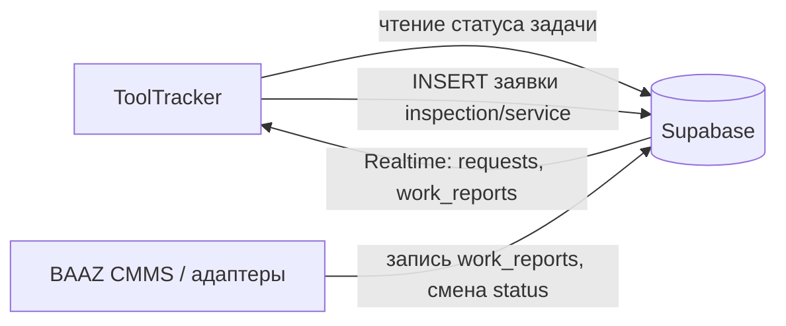

# Use-cases: интеграция с ToolTracker / BAAZ TMS

Спецификация сценариев взаимодействия **BAAZ CMMS** (АС ТОиР) со смежной системой учёта инструмента (**BAAZ Tool Management System**, TMS).

> **Важно:** приложение TMS разрабатывается **в отдельном репозитории** и **отдельном проекте Supabase**. В BAAZ CMMS реализуются контракты интеграции (Edge Functions, webhooks, views); UI кладовой в CMMS нет.
>
> **Актуальный контракт:** [TOOL_TRACKER_INTEGRATION.md](../TOOL_TRACKER_INTEGRATION.md) (CMMS) и `baaz-tool-tracker/docs/CMMS_INTEGRATION.md` (TMS). Документ ниже — UC-TT; при расхождении приоритет у integration docs.

Основание: схема данных в [`DATABASE_TABLES.md`](../DATABASE_TABLES.md).

## Обзор обмена

| Направление | Источник | Потребитель | Данные |
| --- | --- | --- | --- |
| ToolTracker → BAAZ CMMS | ToolTracker (service role / API) | `public.requests` | Автозаявки на калибровку/ТО прибора |
| ToolTracker → BAAZ CMMS | ToolTracker | `public.requests`, `public.maintenance_schedule` | Проверка активной задачи перед выдачей |
| BAAZ CMMS → TMS | `public.work_reports`, `public.requests` | TMS (webhook / Realtime) | Моточасы, закрытие заявки, разблокировка инструмента |
| BAAZ CMMS диспетчер | UC-D8 | TMS API (TMS-API-1) | Заявка на резерв/выдачу — см. [`tms-tool-issuance-proposal.md`](tms-tool-issuance-proposal.md) |

Ключевые поля для связки: `request_id`, `schedule_id`, `tool_id`, `actual_duration_hours`, `status` заявки.

> Ранние строки про отдельную схему `inventory.*` удалены — inventory-поля на `public.requests` (вариант 3). Актуальный контракт — [`TOOL_TRACKER_INTEGRATION.md`](../TOOL_TRACKER_INTEGRATION.md).

---

## UC-TT1 — Проверка легитимности выдачи оборотного инструмента

**Инициатор:** ToolTracker (кладовщик / терминал выдачи)

**Цель:** выдать дорогостоящий инструмент только при наличии активной задачи ТОиР у рабочего.

**Предусловия:** в ToolTracker оформляется выдача; известен исполнитель или привязанный `request_id` / `schedule_id`.

**Основной сценарий:**

1. ToolTracker запрашивает данные BAAZ CMMS: заявка в `requests` со статусом `in_progress` **или** позиция `maintenance_schedule` в работе (наличие открытой задачи по политике интеграции).
2. При положительном ответе кладовщик привязывает транзакцию выдачи к `request_id` или `schedule_id` в ToolTracker.
3. При отсутствии активной задачи выдача блокируется.

**Затронутые сущности BAAZ CMMS:** `requests`, `maintenance_schedule`, `technicians` (сопоставление с рабочим — на стороне ToolTracker).

**Реализация в BAAZ CMMS:** read-only адаптер (запрос по Supabase REST / RPC); политики RLS для `service_role` или выделенной роли интеграции.

---

## UC-TT2 — Списание моточасов / износа оснастки

**Инициатор:** BAAZ CMMS (диспетчер закрывает наряд)

**Цель:** увеличить счётчик наработки инструмента, закреплённого за заявкой.

**Предусловия:** создан `work_reports` с `request_id` или `schedule_id`; в ToolTracker инструмент связан с той же заявкой.

**Основной сценарий:**

1. Диспетчер в BAAZ CMMS сохраняет отчёт с полем `actual_duration_hours`.
2. Адаптер BAAZ CMMS или подписчик ToolTracker на Realtime (`work_reports` INSERT) получает событие.
3. ToolTracker начисляет моточасы на связанный инструмент (логика износа — в ToolTracker).

**Затронутые сущности BAAZ CMMS:** `work_reports` (`actual_duration_hours`, `request_id`, `schedule_id`).

**Реализация в BAAZ CMMS:** публикация события после INSERT в `work_reports` (Realtime достаточно для внешнего потребителя); опционально — исходящий интерфейс `IToolTrackerIntegration.NotifyWorkReportCreated`.

---

## UC-TT3 — Автоматическое инициирование ТО для сложного инструмента

**Инициатор:** ToolTracker (по сроку калибровки или лимиту моточасов)

**Цель:** создать заявку на осмотр/обслуживание прибора без участия человека-заказчика.

**Предусловия:** в ToolTracker сработало правило (калибровка, превышение наработки).

**Основной сценарий:**

1. ToolTracker выполняет `INSERT` в `requests`:
   - `type` = `inspection` или `service`;
   - `location_description` — идентификатор/описание прибора из ToolTracker;
   - `asset_id` — при наличии сопоставления с реестром BAAZ CMMS;
   - `title` / `description` — параметры прибора и причина заявки;
   - `requester_id` — технический профиль интеграции или назначенный системный `requester`;
   - `status` = `new`.
2. Заявка появляется в очереди диспетчера BAAZ CMMS (Realtime на `requests` INSERT).

**Затронутые сущности BAAZ CMMS:** `requests`, `profiles`.

**Реализация в BAAZ CMMS:** входящий адаптер не обязателен (запись идёт напрямую в БД); в приложении — отображение и обработка как UC-D1, UC-D2.

---

## UC-TT6 — Отправка инструмента со склада TMS в ТОиР (контур А)

**Инициатор:** кладовщик или мастер TMS (`/inventory` → «Отправить в ТОиР»)

**Цель:** создать inventory-заявку в CMMS и заблокировать инструмент до завершения ремонта/поверки.

**Предусловия:** инструмент `available`, нет активной `cmms_repair_links`; в CMMS доступен REP-API-1.

**Основной сценарий:**

1. Пользователь TMS выбирает ремонтный отдел и **способ передачи**:
   - `pickup_at_warehouse` — отдел заберёт со склада;
   - `deliver_to_department` — кладовщик передаст в отдел (режим по умолчанию).
2. TMS вызывает REP-API-1 с `inventory_handoff_mode`, `inventory_warehouse_name`; инструмент → `pending_repair`, CMMS → `new` (`repair_zone=workshop`).
3. Диспетчер CMMS принимает заявку и назначает исполнителей (`accepted`).
4. **Забор:** диспетчер CMMS на `RequestDetail` нажимает «Инструмент получен» → `in_progress`, TMS `maintenance`.
5. **Доставка:** кладовщик TMS «Передан в отдел» (REP-API-2) → `in_progress`, TMS `maintenance`.
6. Закрытие заявки CMMS → TMS `pending_return` → «Принят на склад» → `available`.

**Затронутые сущности:** CMMS `requests` (`inventory_*`), TMS `tools`, `cmms_repair_links`.

**Реализация:** REP-API-1/2, Edge Functions `integration-tms-*`; UI TMS `/inventory`; CMMS `RequestDetail` (handoff hint, кнопка получения для pickup).

---

## UC-TT4 — Разблокировка инструмента по результатам поверки

**Инициатор:** BAAZ CMMS (закрытие заявки после работ)

**Цель:** вернуть прибор в статус «доступен для выдачи» в ToolTracker.

**Предусловия:** заявка, созданная по UC-TT3 или вручную, связана с заблокированным в ToolTracker инструментом; работы завершены.

**Основной сценарий:**

1. Диспетчер вносит `work_reports` и переводит заявку в `completed`, затем заказчик/диспетчер — в `closed`.
2. ToolTracker подписан на Realtime `UPDATE` по `requests` (или получает webhook через адаптер).
3. При `status` = `closed` для связанного `request_id` ToolTracker снимает блокировку и обновляет дату последней поверки.

**Затронутые сущности BAAZ CMMS:** `requests`, `work_reports`, `request_status_history`.

**Реализация в BAAZ CMMS:** исходящее событие смены статуса; контракт полей — `request_id`, `new_status`, `updated_at`.

---

## UC-TT5 — Заявка диспетчера на выдачу инструмента

**Инициатор:** BAAZ CMMS (диспетчер, UC-D8)

**Цель:** передать в ToolTracker запрос на выдачу инструмента исполнителю для работ по заявке или ППР.

**Предусловия:** в CMMS оформлена заявка на инструмент; заданы `request_id` или `schedule_id`, `technician_id`, **`warehouse_id`**, перечень инструментов **одного склада**. На один наряд допустимо несколько заявок (по складам).

**Основной сценарий:**

1. Диспетчер в CMMS сохраняет заявку на инструмент (**1 склад**).
2. Адаптер `ITmsIssuanceClient` + `ITmsToolRequisitionService` передают payload в TMS (TMS-API-1) и сохраняют ссылку в `tms_tool_requisition_links`.
3. Кладовщик **склада заявки** резервирует и выдаёт; при необходимости диспетчер создаёт **ещё одну** заявку на другой склад.
4. При закрытии наряда моточасы списываются (UC-TT2).

**Затронутые сущности BAAZ CMMS:** `requests`, `maintenance_schedule`, `technicians`.

**Реализация в BAAZ CMMS:** `ITmsIssuanceClient`, `ITmsToolRequisitionService`, таблица `tms_tool_requisition_links`.

---

## Контракт интеграции (черновик)

Интерфейсы размещаются в `BAAZ.CMMS.Core` (без WinUI). Смежная система может использовать тот же Supabase-проект.

| Операция | Направление | Триггер |
| --- | --- | --- |
| `GetActiveTaskForTechnician` | ToolTracker → BAAZ CMMS | Запрос перед выдачей |
| `OnWorkReportCreated` | BAAZ CMMS → ToolTracker | INSERT `work_reports` |
| `CreateMaintenanceRequest` | ToolTracker → BAAZ CMMS | INSERT `requests` |
| `OnRequestStatusChanged` | BAAZ CMMS → ToolTracker | UPDATE `requests.status` |
| `CreateToolRequisition` | BAAZ CMMS → ToolTracker | UC-D8 | `ITmsIssuanceClient` |
| `SendInventoryToCmms` | ToolTracker → BAAZ CMMS | UC-TT6 | REP-API-1 (Edge Function) |

Аутентификация интеграции: `service_role` или отдельный сервисный ключ с узкими RLS-политиками — уточняется при реализации адаптеров.

## Связанные use-cases BAAZ CMMS

- UC-D4 — источник `actual_duration_hours`
- UC-D2 — статус `in_progress` для UC-TT1
- UC-D8 — инициация заявки на инструмент
- UC-R4 — финальный `closed` для UC-TT4
