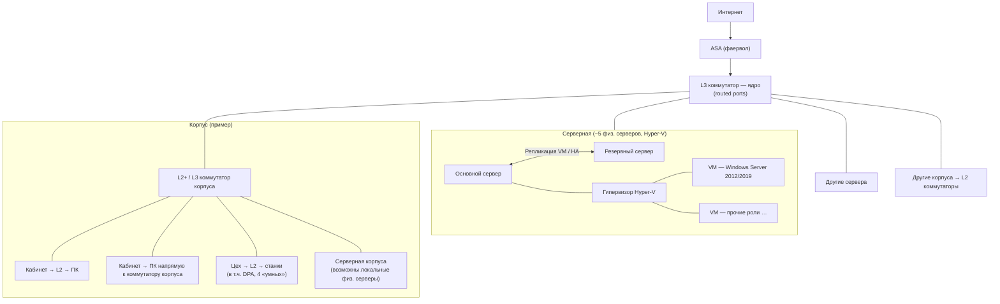

# ОАО «Барановичский автоагрегатный завод» (БААЗ) — справочные материалы для отчёта

## Общие сведения

- **Полное название:** Открытое акционерное общество «Барановичский автоагрегатный завод»
- **Дата основания:** 9 августа 1944 года (Постановление СНХ БССР № 197)
- **Расположение:** г. Барановичи, Брестская область, Республика Беларусь
- **Отрасль:** Машиностроение
- **Директор:** Виталий Александрович Юркевич (с 2010 года)
- **Материнская компания:** БелАвтоМАЗ
- **Численность сотрудников:** 856 человек
- **Сайт:** www.baaz.by

## Инфраструктура предприятия и уточнения от ИТ

> Сведения ниже — по результатам опроса начальника отдела ИТ (2026) и наблюдений при моделировании данных в демо-приложениях.

### Территория, корпуса и склады

- На территории предприятия расположено **множество корпусов** разного назначения: производственные, складские, административные, вспомогательные/утилитарные.
- Складская логистика **не сводится к одному «складу»**: есть **множество отдельных складов** с разным назначением.
- Помимо складов существуют **кладовые** — мини-склады внутри корпуса или цеха.

### Ремонтное обслуживание и оборудование

- **Отделы ремонта** — множество, на **уровне предприятия**, **без иерархии** подчинения (нет деления «корпус → цех → отдел»).
- **Станки** — преимущественно **старые**; есть **пара новых китайских**.
- **Онлайн-мониторинг** времени работы — у **4 станков** (из них **1 сейчас не работает**); программа мониторинга — **DPA** (см. ниже).
- **Инвентарный номер** присвоен оборудованию, которое **учитывается в основных средствах (ОС)** бухгалтерии (т.е. дорогостоящее, которое окупается несколько лет).

### Ответы начальника отдела ИТ

#### Серверы и виртуализация

| Вопрос                     | Ответ                                                                                         |
| -------------------------- | --------------------------------------------------------------------------------------------- |
| ОС на серверах             | **Windows Server 2012** и **Windows Server 2019** (Linux на серверах не используется)         |
| Развёртывание приложений   | Новые виртуалки — **по необходимости** (не «только существующие»); **Docker** — не обсуждался |
| Физические серверы         | **Около 5** (не «больше десятка»); **внешних серверов нет**                                   |
| Гипервизор                 | **Microsoft Hyper-V** (не VMware)                                                             |
| Резервное копирование / HA | **Не уточнялось** (репликация VM, кластер, гибрид)                                            |

> Примечание: при разговоре начальник упомянул, что серверов около 30, возможно речь шла про виртуалки.

#### Мониторинг станков (DPA)

| Вопрос                           | Ответ                                                                                                                                     |
| -------------------------------- | ----------------------------------------------------------------------------------------------------------------------------------------- |
| Система                          | **DPA** (полагаю что речь про [это](https://rundpa.com/))                                                                                 |
| Хранение данных о времени работы | **PostgreSQL**                                                                                                                            |
| Производители станков            | **Открытый API** (не привязка к одному производителю); подключение разных производителей возможно; система **пока в стадии тестирования** |

#### СУБД и прикладное ПО

| Вопрос                                                   | Ответ                                                                                                                                                                |
| -------------------------------------------------------- | -------------------------------------------------------------------------------------------------------------------------------------------------------------------- |
| Используемые СУБД                                        | **Microsoft SQL Server**, **MySQL**, **PostgreSQL**                                                                                                                  |
| «Свои» приложения                                        | **1С** (основное), **C#** (Интермех); Java, PHP, Python, Rust, Go, TypeScript **не упоминались**; тенденция — **уход от самописных программ** из‑за рисков поддержки |
| PLM / CAD                                                | **Компас-3D** (не Autodesk, не SolidWorks)                                                                                                                           |
| Системы автоматизации планирования (APS, закупки и т.п.) | **Не уточнялось**                                                                                                                                                    |

#### Безопасность и доступ

| Вопрос                                   | Ответ                                                                                                                                       |
| ---------------------------------------- | ------------------------------------------------------------------------------------------------------------------------------------------- |
| Доменная авторизация                     | **Да, Active Directory (AD)**                                                                                                               |
| Удалённый доступ                         | **Microsoft RDS** (не Citrix и др.); для **1С** — подключение к RDS-серверу, затем вход в 1С (**двухэтапная** авторизация: ОС → приложение) |
| Сквозная авторизация (SSO через AD/LDAP) | **Нет** — отдельная авторизация на уровне ОС и на уровне каждого приложения                                                                 |
| Группы AD                                | **Много**; перечень и деление на глобальные/локальные (ИТ, бухгалтерия, админы и т.п.) **не описывались**                                   |
| Антивирус                                | **Windows Defender** (ответ «Да» на вариант из вопроса); **дополнительно ESET**; Kaspersky **не упоминался**                                |

#### Прочее

| Вопрос                  | Ответ                                                                                                 |
| ----------------------- | ----------------------------------------------------------------------------------------------------- |
| Сайт **baaz.by**        | **Облачный защищённый хостинг** (не на собственных серверах предприятия)                              |
| VLAN / сегментация сети | **Не уточнялось** (см. описание топологии ниже — как ориентир, не как подтверждённая схема адресации) |

### Топология сети (ориентир по диаграмме)

Ниже — описание приложенной схемы **«Топология сети»**. Начальник ИТ **не давал правок** к диаграмме; схема принимается за **рабочую модель**, согласованную с известными фактами (Hyper-V, ~5 физ. серверов, AD, сегменты корпусов/цехов).

**Логика схемы:**

1. **Периметр:** интернет → **Cisco ASA** (фаервол) → **коммутатор ядра L3** с маршрутизацией между сегментами.
2. **ЦОД / серверная:** **~5 физических серверов** с **Hyper-V**; основной и резервный связаны линией **репликации VM / HA** (конкретный механизм резервирования не уточнялся). На гипервизоре — прежде всего **VM с Windows Server 2012/2019** (СУБД, 1С, RDS, доменные службы и т.д.).
3. **Корпуса:** от ядра — **коммутаторы корпусов** (L2+ или L3); далее **кабинеты** (ПК через локальный L2 или напрямую), **цехи** (станки, в т.ч. с мониторингом **DPA** → **PostgreSQL**), **локальные серверные**.
4. **Масштаб:** линии к **«Другим корпусам»** отражают **множество** производственных, складских и административных зданий на территории.
5. **Не показано явно, но известно отдельно:** **AD** для учётных записей; **RDS** для удалённой работы с **1С**; **baaz.by** — **вне** этой схемы (облако).

**Что на диаграмме может не совпадать с реальностью (не проверялось):** наличие **Linux-VM** (на серверах заявлены только Windows Server); точная модель коммутаторов и ASA; нумерация **VLAN**; способ **backup/DR** beyond подписи «репликация VM / HA».

## Информационные технологии на предприятии

### Используемое ПО

| Система              | Назначение                                                                                | Статус                      |
| -------------------- | ----------------------------------------------------------------------------------------- | --------------------------- |
| **Галактика ERP**    | Основная ERP-система (производство, финансы, логистика, ТОиР)                             | Выводится, заменяется на 1С |
| **1С:ERP**           | Комплексное управление предприятием                                                       | Внедряется                  |
| **1С:Бухгалтерия**   | Бухгалтерский учёт                                                                        | Используется                |
| **1С:Зарплата**      | Расчёт зарплаты и кадровый учёт                                                           | Используется                |
| **1С:Общепит**       | Учёт в столовой предприятия                                                               | Используется                |
| **Интермех**         | PDM-система (управление конструкторской документацией); разработка/кастомизация на **C#** | Внедряется                  |
| **Компас-3D**        | CAD/PLM (конструкторская документация)                                                    | Используется                |
| **DPA**              | Мониторинг времени работы «умных» станков (данные — **PostgreSQL**, открытый API)         | Тестируется (4 станка)      |
| **Эпикур**           | Система управления доступом на проходной                                                  | Используется                |
| **Индиан** (ИНДИНС?) | IT-решения и электроника для автоматизации промышленности                                 | Используется                |
| **Kaspersky, ESET**  | Антивирусы (дополнительно к **Windows Defender**)                                         | Используется                |

### СУБД

| Система                  | Назначение                         | Статус       |
| ------------------------ | ---------------------------------- | ------------ |
| **Microsoft SQL Server** | СУБД прикладных систем             | Используется |
| **MySQL**                | СУБД                               | Используется |
| **PostgreSQL**           | СУБД (в т.ч. хранилище данных DPA) | Используется |

### Сетевая инфраструктура

Подробнее — раздел **«Инфраструктура предприятия и уточнения от ИТ»** выше (топология, AD, RDS, Hyper-V, DPA).

- Локальная сеть на территории **множества корпусов**; ядро — **L3-коммутатор**, периметр — **ASA**
- **Active Directory**; сквозной SSO **не** используется
- Удалённый доступ — **Microsoft RDS** (в т.ч. к **1С**); двухэтапная авторизация: ОС → приложение
- **~5** физических серверов, **Hyper-V**, внешних серверов у предприятия **нет**
- Мониторинг «умных» станков — **DPA** (PostgreSQL); антивирус — **Windows Defender** + **ESET**

### Характер ИТ-среды

Предприятие находится в активной фазе **перехода от устаревшей советской модели к современной ИТ-инфраструктуре**: одновременно выводится Галактика ERP, внедряется 1С:ERP и Интермех. Это типичная ситуация для крупного постсоветского производственного предприятия.

## Галактика ERP vs 1С — краткое сравнение

**Галактика ERP** — российская система, исторически ориентированная на крупное промышленное производство советской модели (цеховой учёт, наряды, маршрутные карты). Глубокий производственный контур, но дорогая, сложная в кастомизации, устаревающий интерфейс, узкое сообщество специалистов.

**1С:Предприятие** — платформенное решение с огромной экосистемой конфигураций. Гибкая, широко распространена, большое сообщество. Производственный учёт присутствует, но для сложных машиностроительных предприятий требует доработки.

Переход БААЗ с Галактики на 1С:ERP — общая тенденция на постсоветских предприятиях, обусловленная доступностью специалистов по 1С и гибкостью платформы.

## Продукция

Автокомпоненты и запасные части для:

- грузовой и автобусной техники
- механических и буксируемых транспортных средств
- железнодорожного транспорта (гидравлические демпферы, амортизаторы локомотивов, крепёжные элементы рельс)
- сельскохозяйственной техники

Ключевые потребители (поставщик сборочных конвейеров): МАЗ, МЗКТ, БелАЗ, Белкоммунмаш, Гомсельмаш, ГАЗ, КамАЗ, Урал, ПАЗ, ЛиАЗ, Ростсельмаш.

## Интегрированная система менеджмента (ИСМ)

Предприятие имеет сертифицированную ИСМ по стандартам:

| Стандарт          | Область                                         |
| ----------------- | ----------------------------------------------- |
| ISO 9001:2015     | Менеджмент качества                             |
| IATF 16949:2016   | Качество для автомобильной промышленности       |
| ISO/TS 22163:2017 | Менеджмент качества для железнодорожной отрасли |
| ISO 14001:2015    | Экологический менеджмент                        |
| ISO 45001:2018    | Охрана здоровья и безопасность труда            |

Применяемые методологии и инструменты: APQP, FMEA, SPC, MSA, RAMS, LCC, FAI, SWOT-анализ, PEST-анализ, бенчмаркинг, бережливое производство, KPI.

## История

Предприятие основано в 1944 году как **Барановичский мотороремонтный завод**. Первый директор — Михаил Филиппович Феденеев. Первоначальная задача — ремонт автомобильных и тракторных моторов.

Ключевые вехи:

- **1945** — создан отдел технического контроля; освоена отливка алюминиевых поршней
- **1956** — освоено производство гидравлических домкратов и амортизаторов
- **1960** — переименован в **Барановичский автоагрегатный завод**
- **1975** — вошёл в состав ПО «БелавтоМАЗ»
- **1978** — внедрена комплексная система управления качеством (КС УКП)
- **2001** — получен национальный сертификат ISO 9001
- **2002** — Лауреат премии Правительства РБ за достижения в области качества
- **2014, 2017** — подтверждение звания лауреата премии Правительства РБ
- **2024** — Диплом I степени «Предприятие года — Лидер в области экспортной деятельности» (конкурс «Лидеры промышленности — 2024»)

## Миссия и Видение

**Миссия:** деятельность направлена на удовлетворение потребностей и ожиданий потребителей отечественного и зарубежного рынков в высокотехнологичных и конкурентоспособных составных и запасных частях при соблюдении сохранности окружающей среды и безопасных условий труда — для повышения доходности завода и роста благосостояния работников.

**Видение:** стать ведущим производителем комплектующих и запасных частей с стратегическим управлением качеством, сочетая высокий уровень подготовки специалистов с масштабным применением новых технологий и ресурсосбережением.

## Концепция риск-ориентированного мышления

Утверждена директором 11.05.2016. Реализация риск-ориентированного мышления — это процесс:

- разработки управленческих решений для снижения негативных результатов
- максимизации прибыли в изменяющейся внутренней и внешней среде
- взаимодействия сотрудников в рамках полномочий, закреплённых в СМБ

Основные принципы: не рисковать больше, чем позволяет капитал; помнить о последствиях риска; не рисковать многим ради малого.

## Корпоративная ответственность

Документ утверждён 02.04.2018. Ключевые аспекты:

- Взаимодействие с заинтересованными сторонами и обществом
- Охрана труда и промышленная безопасность
- Развитие работников и соблюдение их прав
- Природоохранная деятельность
- Противодействие коррупции
